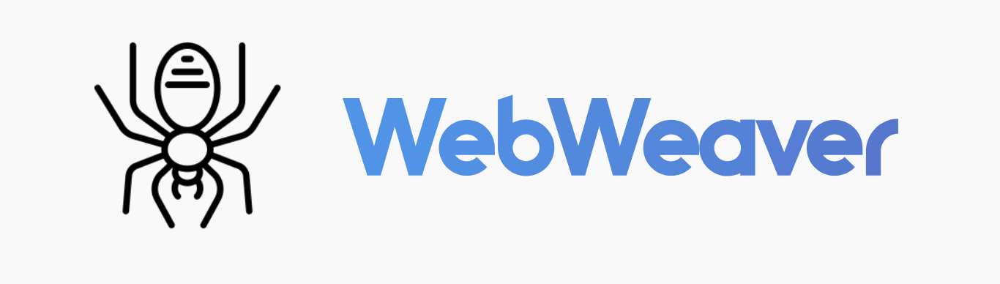
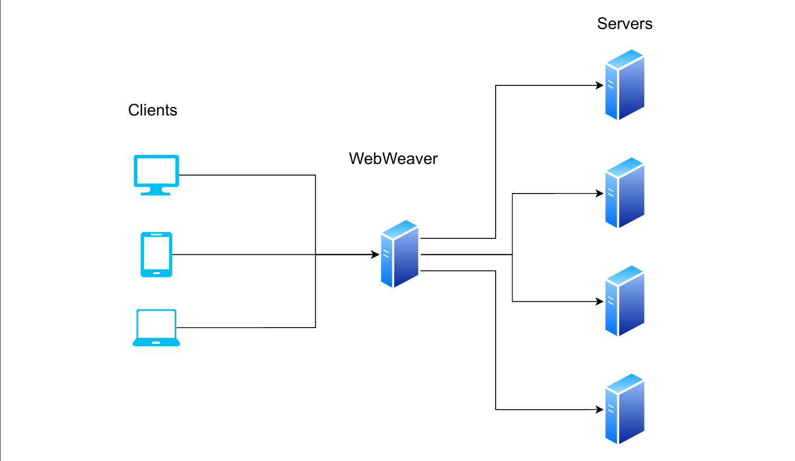
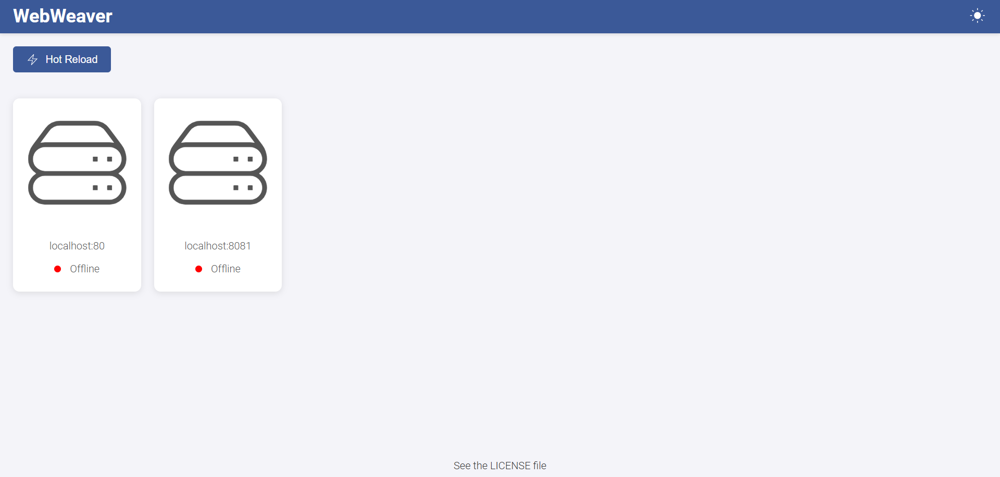

</img>

# 🕸 WebWeaver

WebWeaver is a load balancer written in Go, designed to handle load balancing efficiently and at scale. With a modular architecture and simple configuration, WebWeaver is ideal for modern deployments and high-availability environments.

## 📚 Features

- **Automatic Failover**: Manages automatic failover of unavailable backend servers.
- **Dynamic Configuration**: Supports real-time configuration changes without needing a restart.
- **Fast**: Using the <a href="https://github.com/valyala/fasthttp">fasthttp</a> library, WebWeaver can quickly send packages across your network
- **Load Balancing**: Distributes requests across backend servers using various strategies, including Round-Robin, Random and IP Hash.
- **Monitoring and Logging**: Provides detailed statistics and request logging for in-depth monitoring.
- **Security**: Includes configuration options for protection against common threats and connection management.
- **SSL/TLS certificates**: With <a href="https://letsencrypt.org/">Let's encrypt</a> your domain will automatically have a free SSL/TLS certificate
- **Sticky sessions**: Redirect the same user to the same server using the sticky option
- **Web UI**: Thanks to WebSocket, we can easily render an auto-updating dashboard that provides real-time statistics about your servers

## 👨‍💻 Installation

### 📜  Prerequisites

- **Go 1.25+**: WebWeaver is written in Go and requires a compatible version of Go for compilation.

### 🧪 Installation Steps
1. **Clone the Repository**

    ```
    git clone https://github.com/giovanni-iannaccone/WebWeaver
    ```
    ```sh
    cd WebWeaver
    ```

2. **Run the Project**

    - _Run without compiling_

    ```go
    go run ./cmd/main.go
    ```

    - _Compile with golang_
    ```go
    go build ./cmd
    ```

    - _Compile using makefile_
    ```
    make WebWeaver
    ```

    - _Run in docker_
    ```
    docker build -t webweaver .
    ```
    ```
    docker run -d -p 9000:9000 -p 9001:9001 --name webweaver webweaver
    ```

## ⚙ Configuration

WebWeaver configuration is managed through a JSON file. Here's an example configuration:

```json
{
    "algorithm": "rnd",
    "host": "localhost:9000",
    "dashboard": 9001,

    "servers": [
        "localhost:80",
        "localhost:81"
    ],
    "sticky": true,
    
    "healthCheck": 10,
    "logs": "./LB_LOG.txt",

    "prohibited": [
        "/.env",
        "/secret/"
    ]
}
```

- algorithm: rr for Round Robin, rnd for random choice, iph for ip hash
- host: localhost, an ip or your domain
- dashboard: the port dashboard will run on  
- servers: write here your servers addresses and ports
- sticky: enable sticky sessions
- healthCheck:  seconds of the healthCheck timeout, put less than or 0 if you don't want the server to do any
- logs: file where to save logs, put nothing between quotes if you don't want to save logs 
- prohibited: file you don't want the server to show


## 🎮 Usage



1. Write your configurations in the configs/configs.json file or give it as an argument with ```--config``` or  ```-c``` flag
2. Run the main file with go
3. WebWeaver will automatically synchronize with your servers and start sending them requests
4. Open your browser and visit localhost on the dashboard port you specified in the configuration to see your server's status.

## 🔭 Learn
Let's encrypt: https://letsencrypt.org/docs/ <br>
Golang: https://go.dev/doc/ <br>
Load Balancing: https://www.cloudflare.com/learning/performance/what-is-load-balancing/

## 🧩 Contributing
We welcome contributing. See CONTRIBUTING.md file for details

## ⚖ License
This project is licensed under the GPL-3.0 License. See the LICENSE file for details.


## ⚔ Contact
- For any inquiries or support, please contact <a href="mailto:iannacconegiovanni444@gmail.com"> iannacconegiovanni444@gmail.com </a>.
- Visit my site for more informations about me and my work <a href="https://giovanni-iannaccone.gith
ub.io" target=”_blank” rel="noopener noreferrer"> https://giovanni-iannaccone.github.io </a>

# 📸 Screenshots
